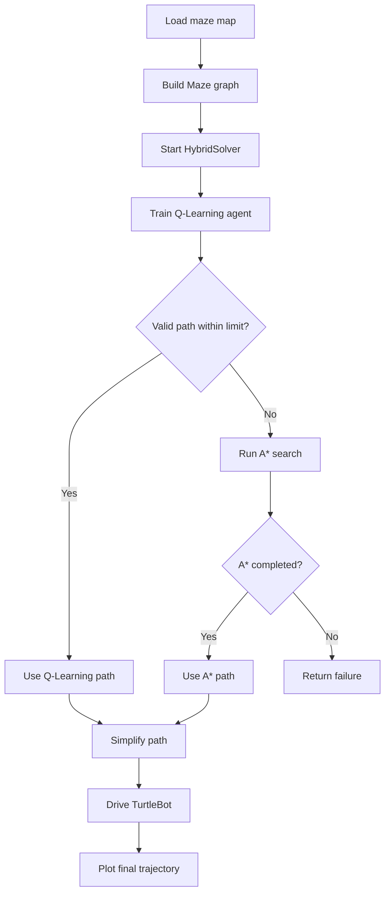

# Hybrid Q-Learning + A* Maze Solver in ROS

A ROS/Gazebo maze-navigation project that combines **reinforcement learning (Q-Learning)** with **classical A* search**.

The main goal of this project is to explore how a learning-based planner and a deterministic search algorithm can be combined in a single navigation pipeline. The solver first attempts to obtain a path using Q-Learning. If the learned policy fails to produce a valid path or exceeds the configured time limit, the system automatically falls back to A*.

## Project Highlights

- Hybrid path-planning strategy using **Q-Learning + A***
- Tabular Q-Learning with an **epsilon-greedy policy**
- Automatic fallback to A* when Q-Learning is too slow or fails
- Manhattan-distance heuristic for A*
- ROS Noetic + Gazebo simulation
- TurtleBot path execution after planning
- PGM/YAML maze map parsing
- Path visualization with Matplotlib

## Demo

A demonstration video of the hybrid maze-solving pipeline is intended to show the complete workflow:

1. Load the maze map.
2. Construct the maze graph.
3. Attempt planning with Q-Learning.
4. Fall back to A* when the Q-Learning solution does not satisfy the hybrid solver conditions.
5. Simplify the generated path.
6. Execute the trajectory using the TurtleBot controller.
7. Visualize the final solution.

> The repository also contains the original ROS maze-solver project structure used as the simulation base. See the **Acknowledgements** section for attribution.

## How the Hybrid Solver Works



The implementation is located in:

```
src/maze_solver/scripts/algorithm/hybridsolver.py
```

The solver creates both planners:

```python
self.q_learning = QLearning(maze)
self.a_star = AStar(maze)
```

It begins with Q-Learning and switches to A* when either:

- Q-Learning exceeds the configured **1.5 s** time threshold after training, or
- the extracted Q-Learning path does not terminate at the maze goal.

This provides a simple example of combining an adaptive learning-based method with a deterministic planner.

## Q-Learning

The Q-Learning implementation is located at:

```
src/maze_solver/scripts/algorithm/q_learning.py
```

Each maze position is represented as a state, with four possible actions:

```
0 = Up
1 = Right
2 = Down
3 = Left
```

The Q-table stores four action values for every valid maze node.

### Default Hyperparameters

| Parameter | Value | Description |
|---|---:|---|
| Learning rate `alpha` | 0.1 | Controls the size of each Q-value update |
| Discount factor `gamma` | 0.9 | Weight assigned to future rewards |
| Initial `epsilon` | 1.0 | Initial exploration probability |
| Epsilon decay | 0.99 | Reduces exploration after each episode |
| Minimum epsilon | 0.1 | Lower exploration bound |
| Training episodes | 1500 | Maximum training episodes used by the hybrid solver |

### Reward Design

| Event | Reward |
|---|---:|
| Valid movement | -1 |
| Invalid movement / wall | -10 |

The agent uses an **epsilon-greedy policy**:

- with probability `epsilon`, choose a random action;
- otherwise, choose the action with the highest current Q-value.

The Q-value update follows the standard Q-Learning rule:

```
Q(s,a) <- (1-alpha)Q(s,a)
          + alpha[r + gamma max Q(s',a')]
```

After training, the solver extracts a path by repeatedly selecting the action with the maximum Q-value from the current state.

## A* Search

The A* implementation is located at:

```
src/maze_solver/scripts/algorithm/astar.py
```

A* is used as the deterministic fallback planner.

The implementation evaluates nodes using:

```
f(n) = g(n) + h(n)
```

where:

- `g(n)` is the accumulated path cost from the start;
- `h(n)` is the Manhattan-distance heuristic to the goal.

The priority queue implementation is stored in the same algorithm directory.

## Maze Representation

The maze graph is implemented in:

```
src/maze_solver/scripts/maze.py
```

Each traversable grid cell becomes a `Maze.Node` containing:

- its `(row, column)` position;
- references to neighbouring cells;
- directional connectivity in the order `[up, right, down, left]`.

The maze map is loaded from a ROS map image and converted so that walls and traversable cells can be represented as a graph.

## ROS Navigation Pipeline

The main execution pipeline is implemented in:

```
src/maze_solver/scripts/main.py
```

The script:

1. loads a YAML map configuration;
2. reads the corresponding maze image with OpenCV;
3. creates the graph representation;
4. selects `astar`, `qlearning`, or `hybridsolver`;
5. generates a path;
6. removes redundant intermediate waypoints on straight segments;
7. sends the resulting trajectory to the TurtleBot controller;
8. plots the solved maze and robot trajectory.

The currently configured planner in `main.py` is:

```python
config = {
    "map_dir": "map",
    "map_info": "map1.yaml",
    "algorithm": "hybridsolver"
}
```

Change `algorithm` to one of:

```
astar
qlearning
hybridsolver
```

to compare the available planners.

## Repository Structure

```text
Qlearning_Astar_maze_algorithms/
├── README.md
├── src/
│   └── maze_solver/
│       ├── CMakeLists.txt
│       ├── package.xml
│       ├── launch/
│       ├── map/
│       ├── maze_model/
│       ├── output/
│       ├── worlds/
│       └── scripts/
│           ├── main.py
│           ├── maze.py
│           ├── TurtlebotDriving.py
│           └── algorithm/
│               ├── astar.py
│               ├── q_learning.py
│               ├── hybridsolver.py
│               └── heapPQ.py
├── build/
└── devel/
```

The most relevant code for the hybrid-planning contribution is:

```
src/maze_solver/scripts/algorithm/
```

## Environment

The underlying ROS project was developed for:

- Ubuntu 20.04 LTS
- ROS Noetic
- Gazebo 11
- Python 3

Python modules used by the project include:

- NumPy
- OpenCV
- Matplotlib
- PyYAML
- rospy

## Running the Project

Clone the repository:

```bash
git clone https://github.com/Hyunjun0716/Qlearning_Astar_maze_algorithms.git
cd Qlearning_Astar_maze_algorithms
```

Build the catkin workspace:

```bash
catkin_make
source devel/setup.bash
```

Make the main script executable if necessary:

```bash
chmod +x src/maze_solver/scripts/main.py
```

Launch one of the configured maze environments:

```bash
roslaunch maze_solver maze1.launch
```

To use another map, update the maze configuration in:

```
src/maze_solver/scripts/main.py
```

and ensure the corresponding YAML/PGM map and launch/world files are available.

## Why Combine Q-Learning and A*?

The two methods have complementary characteristics.

| Method | Strength | Limitation |
|---|---|---|
| Q-Learning | Learns action values through interaction and can encode experience in a policy | Requires exploration/training and may not reliably produce an optimal path within a limited computation budget |
| A* | Deterministic and efficient when a suitable heuristic is available | Relies on an explicit map and search procedure |
| Hybrid | Tries the learned policy first while retaining a deterministic fallback | Current switching logic is based on simple validity/time conditions |

This project demonstrates the basic idea of using classical planning as a reliability layer around a learning-based navigation method.

## Possible Improvements

Several extensions could make the comparison and hybrid strategy more rigorous:

- measure success rate over multiple maze layouts;
- compare path length and planning time for Q-Learning, A*, and the hybrid solver;
- separate Q-Learning training time from inference time;
- save and reload trained Q-tables;
- add explicit terminal-goal rewards;
- detect loops during Q-Learning path extraction;
- use a more principled confidence or convergence criterion for switching planners;
- evaluate DQN or other function-approximation methods on larger environments;
- remove generated Catkin `build/` and `devel/` directories from version control.

## Acknowledgements

The ROS/Gazebo maze environment is based on the open-source **maze_solver** project by joewong00:

https://github.com/joewong00/maze_solver

That project provides the maze-generation/simulation foundation and several classical search implementations. This repository extends that base with the Q-Learning implementation and the hybrid Q-Learning + A* solver.

## Author

**Hyunjun Jang**

Interests: Robotics, Reinforcement Learning, AI, Computer Vision, and Medical Robotics.
